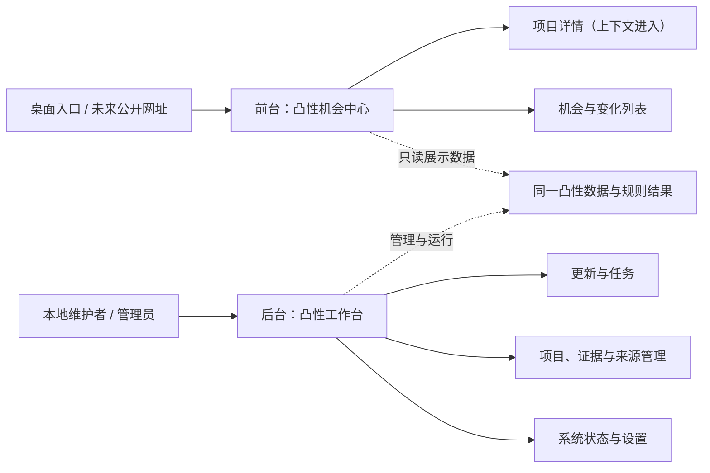

# C1.9 前后台分离与全产品体验重构 PRD

状态：已冻结，等待 Luna 一次性实现  
版本定位：体验版本，不新增核心研究数据能力  
产品名：企鹅投研-凸性

## 1. 版本目标

C1.9 把当前混合产品拆成两个职责明确、视觉一致但任务完全不同的产品表面：

- 前台“凸性机会中心”：让普通用户在 30 秒内看懂当前判断、是否可行动、为什么、发生了什么和主要风险。
- 后台“凸性工作台”：让维护者在 30 秒内看懂系统是否正常、任务是否在运行、运行到哪、哪里失败和下一步怎么处理。

项目详情不再是第三个产品栏目，而是前台或后台各自上下文中的详情页面。

## 2. 非目标

- 不新增信源、Watcher、事件类型、研究数据主干或采集主线。
- 不修改 L0-L5、评分、风险、剩余凸性、交易性、点火距离、五种动作和生命周期分类。
- 不修改自动交易边界；系统仍不连接钱包、不自动下单。
- 不修改数据库中的历史证据、溯源和业务结论。
- 不与 RWA 或旧整合项目共享路由、脚本、状态、数据或文案。

允许的最小后端改动只有“体验状态遥测”：把现有更新过程的阶段、计数和心跳写入本项目运行状态，供后台展示；它不能改变采集结果或研究结论。

## 3. 产品架构



前后台共享数据事实，不共享页面壳、导航、用语和交互控件。未来公开部署时，前台构建不得包含后台路由和管理按钮；本地桌面版可在右上角提供低干扰的“管理工作台”入口。

## 4. 前台：凸性机会中心

### 4.1 导航

前台不使用常驻左侧栏，改为浅色顶部导航：

1. 机会首页
2. 全部机会
3. 重要变化
4. 我们如何判断

“项目详情”不在导航中。“催化路径”不作为数据库式全量栏目；催化与风险在机会卡片和项目详情中按用户问题展示。C1.9 不建立独立前台“催化观察”页，完整催化路径维护留在后台。

本地桌面版右上角可显示“管理工作台”；未来大众版不显示该入口。

### 4.2 首页只回答四个问题

#### A. 现在有没有可以行动的机会

- 首屏主结论只显示：当前判断、可行动数量、结论有效时间、数据是否完整。
- 若更新失败，明确写“本轮数据不完整，以下沿用上次有效判断”，不得把 0 个可行动写成市场事实。
- 五种动作保持冻结名称，但只突出有内容的动作；空动作弱化为辅助统计。

#### B. 哪些最值得先看

- 默认最多 6 个项目，按当前研究优先级展示，不按数据库顺序。
- 每张卡片只显示：项目、当前动作、一句话理由、最大风险、最近变化时间。
- “已满足 3/5 项、负责人、下次检查”等维护信息不放在卡片主层。

#### C. 最近发生了什么重要变化

- 首页最多 5 条，只显示足以影响阶段、风险、交易性、剩余凸性或当前动作的真实变化。
- “分层未变”“首次建立比较基线”“规则重算”默认不进入前台变化流。
- 每条使用“变化前 → 变化后 + 为什么重要”的普通语言；技术字段放在“查看依据”折叠层。

#### D. 为什么当前不行动

- 首页只显示最主要的 1 至 3 个原因，按影响项目数和阻断严重度排序。
- 标题建议采用“当前主要限制”，避免过度口语化，也避免后台术语。
- 每项只回答：缺什么、这为什么重要、系统何时会重新判断。负责人、任务 ID、来源适配和重试入口不展示。

### 4.3 前台栏目与语言

| 当前表达 | C1.9 前台表达 | 后台是否保留原词 |
|---|---|---|
| 本轮行动结论 | 当前判断 | 是 |
| 接近行动门槛 | 离行动最近 | 是 |
| 行动条件与缺口 | 当前主要限制 | 是 |
| 项目主体待核验 | 尚未确认项目与官方主体的关系 | 是 |
| 可购买资产待核验 | 尚未确认应该通过哪个资产参与 | 是 |
| 市场与退出待闭环 | 目前无法确认能以可接受成本卖出 | 是 |
| 价值传导待闭环 | 尚未证明事件会把价值传导给该资产 | 是 |
| 系统尚未发现催化 | 暂未发现可能改变判断的明确事件 | 是 |
| 规则重算 | 系统重新评估后 | 是 |
| 分层未变 | 没有影响当前判断的新变化 | 后台保留，前台默认隐藏 |
| 系统工作与需要我处理 | 数据状态 | 后台保留任务管理 |
| 负责人：系统自动核验 | 系统会继续确认 | 后台显示真实责任与任务 |

### 4.4 项目详情

进入方式：从结论、机会卡片、变化、搜索结果或项目列表进入。

返回方式：按钮文字根据来源变化，例如“返回机会首页”“返回重要变化”“返回第 3 页”；必须恢复原筛选、页码和滚动位置。

详情结构：

1. 一句话当前判断：动作、判断时间、数据完整性。
2. 为什么值得关注：凸性来源和价值捕获，用自然语言概括。
3. 为什么现在不行动或如何行动：只显示与当前动作直接相关的条件。
4. 最近发生了什么：最多 5 条真实变化，其余分页查看。
5. 催化、风险与失效：可能推动判断的事件、最大损失来源和判断失效条件。
6. 证据与数据时间：默认折叠，展开后显示来源、时间和事实/推断区分。

删除顶级“项目详情”导航和近 600 项的全量下拉框。项目切换改为搜索或“上一个/下一个同筛选结果”，只在用户确有上下文时出现。

### 4.5 列表边界

- 所有前台长列表使用明确分页或“查看全部”，禁止无限滚动。
- 首页每块不超过 6 条；独立列表默认每页 20 条。
- 变化页默认只看最近 7 天的重要变化；没有变化时给出清楚空状态，不用无变化记录填满页面。
- 筛选项使用普通语言，并提供“重置筛选”；返回详情后必须恢复。

## 5. 后台：凸性工作台

### 5.1 导航与信息架构

后台使用浅色左侧导航，保留适合管理系统的稳定位置，但不再使用深色渐变。一级栏目：

1. 工作台概览
2. 更新与任务
3. 项目管理
4. 证据与来源
5. 监控与催化
6. 模型与规则
7. 系统设置与日志

现有页面归并：

| 新栏目 | 归并的现有能力 |
|---|---|
| 工作台概览 | 系统健康、最近运行、待处理异常、唯一建议下一步 |
| 更新与任务 | 更新中心、跟踪执行、二次验证、失败重试、调度 |
| 项目管理 | 项目队列、机器发现、链上发现、弱线索、人工纠错 |
| 证据与来源 | 原始证据、信源状态、主干接入、数据主干、孤儿证据 |
| 监控与催化 | 监控基础设施、后台催化路径、到期任务 |
| 模型与规则 | 硬门槛、四层筛选、规则回放、校准、模型验收 |
| 系统设置与日志 | 自动运行时间、健康状态、运行日志、数据字典、备份提示 |

工作台顶部不再重复一排八个横向导航；高级工具不再平铺近 20 张同权卡片。

### 5.2 工作台概览

首屏只保留四块：

1. 系统状态：正常、运行中、部分完成、失败或可能卡住。
2. 当前任务：任务名、阶段、进度、开始时间、最近心跳。
3. 待处理事项：按“必须处理、建议处理、无需处理”分组。
4. 最近结果：成功项、失败项、数据更新时间和上次有效结论。

页面只给一个主操作，例如“查看当前更新”“处理 3 个失败来源”或“当前无需操作”。

### 5.3 全量更新进度

后台必须把长任务展示为持续可观察的过程，而不是一个旋转图标。

#### 状态字段

- `state`：等待、运行中、部分完成、成功、失败、可能中断。
- `stage`：当前七阶段名称，固定为“市场与退出数据”“项目与证据发现”“合约与身份归属”“项目档案与研究材料”“监控与数据健康”“研究结论与催化”“跟踪与页面发布”。18 个现有技术组件的唯一映射见 `docs/C1.9_DESIGN_SPEC.md`。
- `stageIndex / stageTotal`：当前第几阶段。
- `completedItems / totalItems`：总量已知时显示；未知时不伪造百分比。
- `successCount / failedCount / waitingCount`：本轮累计结果。
- `currentItem`：当前来源或任务的普通名称；敏感信息不进入状态。
- `startedAt / lastHeartbeatAt`：开始时间与最近活动时间。
- `elapsed`：已运行时间。
- `estimatedRemaining`：只有历史数据足以可靠估算时才显示，否则写“暂无法准确估计”。

#### 运行中页面

```text
凸性全量更新                         运行中
阶段 3/7：合约与身份归属
[███████████░░░░░░░]  已处理 318 / 594 个项目
成功 287   等待 24   失败 7
最近活动：20 秒前 · 正在检查 CoinGecko 市场数据
已运行 36 分钟 · 剩余时间暂无法准确估计

离开页面不会中断；窗口关闭后由本项目后台任务继续运行。
```

#### 卡住与失败的区分

- 最近心跳仍在更新：明确显示“正常运行”。
- 正在等待外部来源：显示来源名称、已等待时间和超时规则，不写成程序失败。
- 心跳超过约定阈值：显示“长时间没有新进度，可能卡住”，提供查看步骤和日志入口，但不自动宣判失败。
- 程序明确返回错误或进程退出：显示“失败”，列出成功数据是否已保留、失败范围和可重试入口。
- 部分完成：成功和失败必须分开计数，不用长段技术文本替代摘要。

进度状态需在切换栏目、刷新页面和重新打开软件后仍可读取。状态写入本项目运行目录或现有更新状态文件，不写入公共 API 库或其他业务目录。

### 5.4 后台列表与错误处理

- 默认先显示失败、到期和需人工判断的项目；成功历史放入可筛选记录。
- 失败按来源或原因聚合，不把 100 多个相同错误平铺成 100 多行。
- 每个错误组显示：影响范围、最后失败时间、是否可重试、成功数据是否保留。
- 原始技术日志默认折叠；普通维护者先看可执行结论。
- “立即运行”“暂停”“恢复”“重试”全部只存在后台，并明确影响范围。

## 6. 视觉设计系统

### 6.1 总体方向

- 继续使用南极蓝品牌色和现有 Logo、口号。
- 全产品使用白色、冰川灰和很浅的南极蓝为主背景；删除大面积深色左栏和重渐变。
- 前台偏内容阅读，后台偏任务管理，但共用同一套字体、按钮、状态和间距。

### 6.2 字体与层级

- 中文主字体：`PingFang SC`、`Microsoft YaHei UI`；英文与数字：`Inter`、`Segoe UI`。
- 不在大段业务标题中混用衬线体；英文全大写眉题从前台移除，后台也仅在必要时使用。
- 页面标题、模块标题、卡片标题、正文、辅助信息至少形成五级稳定字号和字重。
- 时间、来源数量、版本号和技术说明使用弱化色；当前判断、动作、重要变化和失败状态使用高对比。

### 6.3 导航

- 前台：浅色顶部导航，无常驻左栏。
- 后台：浅色左栏，选中项使用浅蓝底和南极蓝文字，不使用整栏深色。
- 同一页面只存在一套主导航；不再出现桌面壳导航套页面导航。
- 前后台切换必须明确显示“进入管理工作台”或“返回机会中心”，不能让用户误以为是同一栏目。

### 6.4 卡片与状态

- 结论卡片：少边框、强标题、明确动作和一句话理由。
- 普通列表：降低卡片密度，优先使用行、分组和留白。
- 成功、警告、失败不能只靠颜色；同时使用图标和文字。
- 同一屏只允许一个主按钮；次要操作使用文本按钮或更多菜单。
- 加载、空数据、数据过期、更新失败、部分完成和权限不足分别设计，不共用“暂无数据”。

### 6.5 版本号唯一位置

- 面向用户可见的业务版本号只在后台工作台浅色左侧栏底部固定显示一次，格式为“当前版本 C1.9”。
- 前台机会中心、项目详情、桌面宿主、Logo 附近、页眉、页脚、卡片和普通栏目不显示 M1.0、C1.7、C1.8 或 C1.9 等版本标签。
- 后台子页面不得在标题、页脚或正文重复版本号；内部健康接口、日志、文档和验收清单可保留机器版本字段。

## 7. 关键交互

- 所有进入详情的入口都记录来源上下文；返回必须回到原位置。
- 前台搜索只搜索项目，不暴露任务、来源或数据表。
- 后台全局搜索可搜索项目、任务和来源，并明确结果类型。
- 前台不允许触发写操作；后台写操作前说明影响范围，完成后显示可验证结果。
- 自动更新运行时可安全离开页面；切回后恢复当前状态，不重新发起任务。
- 页面最多两级展开；深层技术细节进入独立后台详情，不用连续折叠嵌套。

## 8. 实施顺序建议

1. C1.9-00：冻结前后台页面清单、用语表、线框图和验收样例。
2. C1.9-01：建立前台壳、后台壳和浅色设计令牌；先不迁移业务内容。
3. C1.9-02：重做机会首页、全部机会和重要变化；建立前台专用页面。
4. C1.9-03：重做上下文项目详情和返回记忆；删除顶级详情入口。
5. C1.9-04：重组后台导航、工作台概览和页面归类。
6. C1.9-05：增加运行阶段、计数和心跳状态，重做更新进度与失败聚合。
7. C1.9-06：统一空状态、加载、错误、部分完成、字体和可访问性。
8. C1.9-07：普通用户与后台维护者双角色真实点击验收，Sol 最终发布。

上述顺序是规划建议，不构成编码授权。

## 9. Sol 规划阶段已确定的产品选择

1. 前台第四个导航使用“我们如何判断”，比“研究方法”更接近普通用户语言。
2. 本地桌面版在右上角提供低干扰“管理工作台”入口，不新增第二个桌面快捷方式；未来大众构建隐藏该入口。
3. C1.9 不建立独立前台“催化观察”页；重要催化进入首页和项目详情，完整管理留在后台。
4. 可见版本号只在工作台左侧栏底部固定显示一次，不出现在前台、详情和其他页面。

## 10. 冻结状态

用户已于 2026-08-03 明确回复“按当前方案冻结 C1.9”。本 PRD、页面清单、设计规格、用语字典和验收计划共同构成冻结需求；只有 Luna 阶段可以开始常规产品代码修改。

需求范围变化必须先停止实现并返回 Sol 重新评审，不得由 Luna 临场扩展。

## 11. 模型执行与交接

- Sol 在当前单一规划任务内完成用户反馈收口、正式 PRD、验收计划、阶段文件、需求哈希锁和 Luna 交接包。
- 冻结完成后 Sol 停止，不开始常规编码；必须提醒用户切换到 Luna，并给出 `docs/MODEL_HANDOFF_PROTOCOL.md` 中的固定实现提示。
- Luna 在一个任务内完成 C1.9 全部冻结范围编码和开发自测，不拆成多次 Luna 任务，不临时改变设计，不宣布发布。
- Luna 自测完成后把阶段改为 `luna_self_test_complete_waiting_sol`，提醒用户切回 Sol并停止。
- Sol 独立执行最终验收；冻结范围内问题由 Sol 直接修复并重新验收，全部通过后发布。

## 12. 配套设计文件

- 页面唯一归属：`docs/C1.9_PAGE_INVENTORY.md`
- UI 与交互规格：`docs/C1.9_DESIGN_SPEC.md`
- 前后台用语字典：`docs/C1.9_COPY_DICTIONARY.md`
- 独立验收计划：`docs/C1.9_ACCEPTANCE_PLAN.md`
