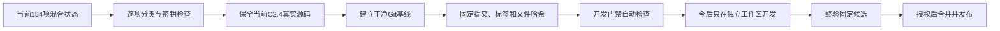
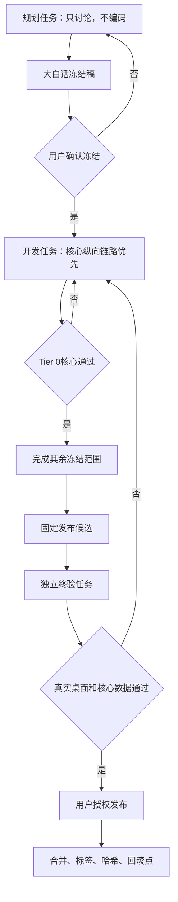

# 企鹅投研-凸性｜开发体系重置0大白话冻结稿

状态：**用户已确认，正式冻结；等待另行授权执行**  
冻结时间：2026-08-14T11:48:05+08:00  
用户确认语：`按冻结稿冻结开发体系重置0`

## 1. 这不是产品新版本

开发体系重置0简称 `D0`。它不是 C2.5，不改变用户可见版本；完成后产品仍显示 C2.4。

D0 只解决一个问题：以后必须能够准确回答“从哪份正式代码开始、改了什么、验收的是哪份代码、发布的是哪份代码、失败后退回哪里”。

冻结时现场只读快照：

- Git 分支：`main`
- 工作区状态项：154
- 已跟踪文件改动：45
- 未跟踪文件：109
- Git 提交数：2
- 最新提交：`a302c6b feat: release C2.2 tracking integration`
- 当前产品事实：C2.4 已发布，但 C2.3/C2.4 的完整源码状态尚未形成对应的干净 Git 发布提交

上述数字是冻结时审计快照，不是执行完成标准中的固定业务数据。

## 2. 最终结果

完成后：

1. 正式目录只运行已经发布的主干。
2. 新开发不直接污染正式目录。
3. 测试针对固定 Git 提交，不针对不断变化的文件夹。
4. 验收候选和发布候选必须是同一份代码。
5. 每次发布都有提交、标签、文件哈希和回滚点。
6. 用户不再承担发现核心漏开发和判断测试是否可信的主要责任。

## 3. 已确认的四项选择

1. 用户同意在正式执行阶段新增 `F:\codex项目\企鹅投研\凸性-worktrees\<任务名>`，只保存临时代码工作区，不复制正式数据库。
2. 用户同意在完成密钥检查、分类、验收和发布授权后，把重建的 C2.4 基线推送到现有公开 GitHub。
3. 用户接受“C2.4 重建基线”只代表准确保存当前实际产品，不代表六链、筛选规则或其他已知业务问题全部正确。
4. 用户接受正常版本默认分为规划冻结、开发自测、独立终验发布三个任务；任务责任分离不绑定模型，模型始终由用户决定。

## 4. 154项现状如何处理

每个状态项必须先登记，再归入以下一类：

| 类别 | 处理 |
| --- | --- |
| 正式源码 | 去敏后进入 Git |
| 正式产品文档 | 去重并登记后进入 Git |
| 编译、生成和临时文件 | 登记后按已有安全清理规则处理，不上传 GitHub |
| 数据库、运行状态、日志和缓存 | 留在本地，不上传 GitHub |
| API 密钥和敏感配置 | 与公开文件和 Git 隔离 |
| 无法确认的文件 | 保留并隔离，不猜测用途、不直接删除 |

分类前不得删除文件，不得使用 `git reset --hard`，不得整目录覆盖。

## 5. C2.4重建基线

执行时必须：

1. 先为本次涉及的源码和文档建立路径、大小和 SHA-256 清单；不为此复制 7GB 以上数据库。
2. 检查密钥、数据库、日志、缓存、临时副本和个人路径。
3. 在 D0 专用分支形成去敏的“当前 C2.4 保全提交”。
4. 只读验证桌面入口、C2.4 健康身份和核心页面。
5. 验证通过后才允许合并到 `main`。
6. 创建明确带有 `reconstructed-baseline` 含义的标签，不冒充 2026-08-13 原始发布时就存在的提交。
7. 只有公开仓库密钥检查通过后才允许推送 GitHub。

如果当前产品存在已知业务缺陷，必须写入已知问题清单；不能为了形成干净提交顺手修复或隐藏。

## 6. 正式目录和开发目录

| 位置 | 冻结职责 |
| --- | --- |
| `F:\codex项目\企鹅投研\凸性` | 正式主干、正式数据和正式桌面软件 |
| `F:\codex项目\企鹅投研\凸性-worktrees\<任务名>` | 经授权后建立的临时代码工作区；不得存放正式数据库、凭据或正式运行状态 |

正式目录必须在新任务开始前保持干净。临时工作区完成合并与证据保全后，按照登记和保留策略清理。

## 7. 项目正式记忆

D0 执行阶段建立以下当前真相入口：

1. `AGENTS.md`：长期红线、项目禁区和“完成”定义。
2. `docs/CURRENT_STATE.md`：当前版本、提交、标签、现役任务、已知问题和下一项授权，不超过约 100 行。
3. `docs/PRODUCT_BASELINE.md`：当前主干必须继承的页面、作业、数据链路和桌面能力。
4. `docs/DEVELOPMENT_WORKFLOW.md`：规划、开发、终验、发布和热修复流程。
5. 历史索引：旧状态、记忆和决策不删除，但不再与当前状态争夺优先级。

缩短 `AGENTS.md` 前必须先保存当前原文并建立逐条规则去向映射；没有明确新位置的规则不得删除。

## 8. 以后固定的开发阶段

普通版本使用三个任务；同一任务可以由用户选择的任意模型执行。小型低风险修复可以缩短流程，但触及核心业务、规则、数据库、调度、桌面容器或发布时不得省略独立终验。

## 9. 自动门禁

D0 执行阶段建立统一门禁，至少覆盖：

- 开发开始：目录、分支、干净主干、需求锁、继承基线、回滚点。
- 终验开始：需求追踪、固定样本、Tier 0、候选提交固定。
- 发布开始：终验提交与发布提交相同、真实桌面通过、密钥与数据隔离、标签和回滚清单存在、用户已授权。

门禁必须有反向测试：故意制造脏主干、错误哈希和 Tier 0 失败时应明确阻断。

## 10. 测试范围

1. 文案或单页样式：改动页面和真实桌面点击。
2. 单一接口或来源：复现测试、直接依赖和对应页面。
3. 规则或门槛：固定正反样本、独立重算和漏斗交接。
4. 数据库、调度或恢复：核心回归、断点恢复和数据库检查。
5. 桌面容器、共享核心或发布：Tier 0 至 Tier 3 的完整相关验收。

小修目标 5 分钟内得到第一轮结果，中等改动目标 20 分钟内完成受影响回归；这是管理目标，不是跳过必要测试的硬上限。超时必须说明正在测试什么、必要性和是否能分段。Tier 0 失败后停止低优先级测试。

## 11. 长任务

预计超过 15 分钟的任务必须具备任务编号、单实例锁、分片、断点、可恢复游标、进度、心跳、错误分类、重试上限和关机恢复。长任务不能只依赖模型任务持续存在，也不得因为监测而重复启动或从头重跑。

D0 本身只盘点现有后台任务，不停止、不重启、不改变调度或用户暂停设置。

## 12. 明确禁区

D0 不得：

- 修复或调整六条链；
- 调整第一关、第二关、强证据路径或贝叶斯规则；
- 修改机会中心或工作台 UI；
- 开始 C2.5；
- 写入 `data/convexity.db` 或 `data/c2.1-pipeline.db`；
- 重跑 Gate 0、459 万或 90 天历史扫描；
- 删除用途未确认的文件；
- 上传密钥、数据库、日志或运行状态；
- 强制指定、审核或反复提醒模型；
- 把重建基线描述成业务正确性认证。

## 13. 程序上限

程序可以保证：主干是否干净、候选是否漂移、需求锁是否匹配、测试是否通过、回滚点是否存在、是否误提交已识别密钥或运行数据、需求是否有验收证据。

程序不能保证：永远没有 Bug、外部 API 永远稳定、所有链上项目都被发现、投资判断正确、新任务自动记住旧任务每句话、增加测试数量即可发现所有业务错误。

## 14. D0完成条件

只有同时满足下列条件才可宣告完成：

1. 冻结时 154 项现状全部分类，未知项没有被直接删除。
2. 公共 Git 仓库不含数据库、运行日志和明文密钥。
3. 当前 C2.4 实际源码形成去敏正式提交和重建基线标签。
4. `main` 工作区干净。
5. 正式桌面入口仍可启动并返回 C2.4 身份。
6. C2.4 核心只读路径未因 D0 受损。
7. 当前状态、产品基线、开发流程和历史索引完成。
8. 开发、终验和发布门禁正向与反向测试通过。
9. 完成一次不写正式业务数据的代码回滚演练。
10. 现有后台任务未被擅自中断、重启或改配置。
11. 生成 D0 独立验收报告。

## 15. 异常停止条件

出现文件用途无法确认、密钥风险、基线无法启动、Git 状态无法安全重建、后台任务会被影响或候选与正式入口无法对应时，立即停止合并和公开推送，保留当前正式软件运行，报告阻断，不用破坏性命令绕过。

## 16. 阶段授权

本次冻结只授权生成并锁定 D0 文档。它不授权执行分类、创建工作区、修改 `AGENTS.md` 结构、提交、合并、打标签、清理或推送。

执行必须等待用户另行明确回复：`开始开发体系重置0`。
