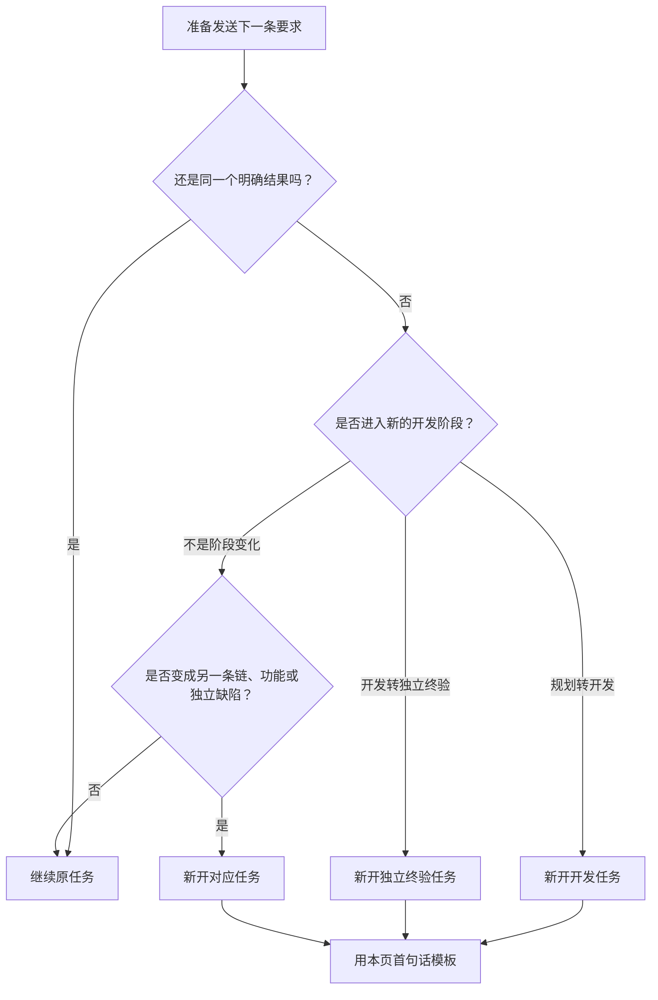

# 企鹅投研-凸性｜什么时候新开任务，以及第一句话怎么说

更新时间：2026-08-14

## 1. 用户只需要记住的结论

一个版本默认使用三个任务：

- **目标或阶段变了**：新开任务。
- **仍在解决同一个结果**：继续原任务。
- **只是切换模型、重新连接、继续断点或等待后台任务**：不要新开任务。

新任务应在同一个“企鹅投研-凸性”项目中创建。项目文件负责长期记忆；不要假设新任务会准确记住旧任务的每句话。

## 2. 新开任务判断图

## 3. 哪些情况继续原任务

以下情况不需要重开：

- 继续讨论同一份大白话冻结稿，补充或纠正同一需求。
- 同一冻结范围内继续编码、自测、修复和受影响重验。
- 独立终验发现缺陷后修复，再对同一候选范围重验。
- 终验通过后，用户在同一任务中明确授权发布同一候选。
- 用户说“继续”“刚才断了”“检查进度”或“等待后台任务完成”。
- 只切换模型；模型变化不改变任务目标和阶段。

## 4. 哪些情况新开任务

以下情况建议在同一个项目中点击“新任务”：

1. 开始一个新的版本、独立功能、逐链排查或治理目标。
2. 大白话冻结稿已经确认，准备从规划进入整版开发。
3. 开发已经形成固定候选，准备开始独立终验。
4. 当前工作真正分叉为两个可以分别交付的结果，例如“管理者控制面”和“Robinhood 链修复”。
5. 原任务已经异常臃肿，且当前阶段已有固定提交、需求锁或可恢复断点；此时新开轻量续作任务，不复制整段旧聊天。

仅仅因为对话很长，不应在任务中途无断点拆分。应先固定需求锁、提交、报告或后台游标，再新开任务。

## 5. 通用第一句话

用户只需复制下面一句，替换方括号内容即可：

> 继续企鹅投研-凸性：开始【任务名】的【规划与冻结 / 开发与自测 / 独立终验与发布】，先按项目里的 D0 开发流程恢复当前状态；本次只完成【目标】，不做【非范围】，做到【我能看到的结果】算完成。

这句话包含 OpenAI 建议的四个要素：目标、上下文、约束和完成标准。用户不需要记文件名，也不需要粘贴全部旧对话；读取正式文件和核对需求锁是 Codex 的责任。

## 6. 可直接使用的四种开场白

### A. 开始规划

> 继续企鹅投研-凸性：开始【版本或修复名】规划，只讨论并整理大白话冻结稿，不编码；先读取当前真相和开发流程，完成标准是我能确认目标、非范围、程序上限、继承项和验收画面。

### B. 开始开发

> 继续企鹅投研-凸性：按已冻结的【需求锁路径】开始【版本或修复名】开发；先核对正式 `main`、回滚点和独立工作区，只改冻结范围，Tier 0 核心链路通过前不扩展低优先级工作。

### C. 开始独立终验

> 继续企鹅投研-凸性：对固定候选提交【完整提交哈希】执行【版本或修复名】独立终验；不相信开发报告，先按需求锁独立核对 Tier 0，再验受影响规则、恢复和真实桌面路径。

### D. 开始独立热修复

> 继续企鹅投研-凸性：修复【具体可见现象】，先建立可复现证据并确认根因，只改直接影响范围，不改变冻结业务规则；完成标准是【真实用户路径和预期结果】通过。

发布通常不需要再开第四个任务。独立终验通过后，用户可在同一任务直接说：

> 发布已通过独立终验的【版本或修复名】候选【完整提交哈希】。

## 7. Codex 接到新任务后必须做什么

1. 读取 `AGENTS.md`、`docs/CURRENT_STATE.md`、`docs/DEVELOPMENT_WORKFLOW.md` 和当前阶段文件；已经冻结或进入终验时再读取对应需求锁。
2. 核对正式分支、提交、工作区、回滚点和未完成阶段，不用旧聊天覆盖正式文件。
3. 用一小段话复述目标、非范围、假设和成功标准；有实质歧义时先停下确认。
4. 按 D0 阶段门禁执行，不因为新任务而重新跑已完成的全量任务或丢失后台断点。
5. 最终报告修改文件、验证结果、风险和用户下一步。

## 8. 官方方法依据

- [OpenAI：Projects and chats](https://learn.chatgpt.com/docs/projects)：同一项目保存共享背景；每个不同结果使用独立任务，同一问题继续原任务。
- [OpenAI：Best practices](https://learn.chatgpt.com/guides/best-practices)：首个提示应明确目标、上下文、约束和完成标准；复杂任务先规划，再执行和验证。

项目冻结文件和本页规则优先于通用外部建议。
