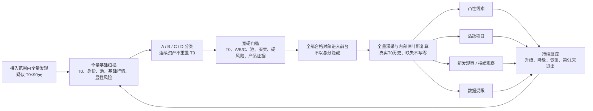

# 企鹅投研-凸性｜产品总路线图

状态：产品战略基线已按用户确认重写；后续版本均未冻结、未编码  
重写时间：2026-08-04 16:32（Asia/Shanghai）  
历史规划模型：`gpt-5.6-sol`；自 2026-08-10 起模型由用户自行决定，不再审核或强制交接  
适用范围：企鹅投研-凸性独立项目  

> 用户于 2026-08-04 确认：以“代币首次公开流通”定义新发项目；老项目新币单独区分，关系不明仍进入新发池并明确标记；新项目池只保留 0—30 天和 31—90 天，第 91 天退出；取消全部时间权重、加权分和由年龄暗示投资质量的表达。采集采用“全量基础扫描—达标对象全量深度采集”，不以 20 个或其他固定样本代替正式采集与算法校准。产品运行中不设置逐项目人工复核与发布确认。本路线图只确定终局、能力边界和阶段顺序，不授权下一版本编码，也不修改已发布 C2.0。

## 1. 结论

企鹅投研-凸性的长期产品定位调整为：

> **一套完全自动运行的新发代币项目发现与可信度筛选系统：持续发现最近 90 天进入公众流通的代币，核验发行时间、项目关系、身份、产品活动、合约与退出风险，筛出带证据的凸性线索，并在证据不足时主动放弃判断。**

产品不再尝试为全部成熟项目持续形成复杂投资判断，也不建立逐项目人工通过、退回或确认流程。

程序最终交付的是“值得进一步关注的新发代币线索”，不是“已经证明靠谱的项目”，更不是建仓、仓位或收益结论。用户仍负责最终投资判断。

## 2. 产品定位

### 2.1 服务对象

- 前台“凸性机会中心”：服务希望快速发现新发代币项目并核验理由、风险和缺口的阅读者，未来可形成独立公开产品。
- 后台“凸性工作台”：服务系统维护者，负责来源、采集、异常、规则、运行、回放和恢复；不设置日常项目内容复核岗位。

前后台继续严格独立，不混用页面壳、导航、管理控件和责任语言。

### 2.2 产品只解决五个问题

1. 最近 90 天有哪些代币第一次向普通公众开放领取、转让或交易？
2. 它对应新项目、老项目、关系不明项目，还是只有代币而无法建立项目身份？
3. 项目身份、产品活动、资产关系、合约行为、流动性和退出条件有哪些事实与风险？
4. 哪些候选出现了可追溯的凸性线索，哪些只能继续观察、自动排除或无法判断？
5. 后续什么事实会升级、降级、撤回或让候选在第 91 天自动退出新发池？

### 2.3 产品不是什么

- 不是所有加密项目的百科、估值库或成熟项目投资顾问。
- 不是价格预测器、收益保证工具或“靠谱项目认证”。
- 不因为发币更早、更新、低市值、上涨或社交热度而认定质量更高。
- 不生成普通建仓、极限试仓、仓位、买卖点或账户级交易命令。
- 不连接钱包，不自动下单，不替用户承担投资责任。

## 3. “新发代币项目”的唯一时间定义

### 3.1 代币首次公开流通时间 T0

`T0` 定义为：

> **官方代币第一次允许普通公众实际取得，并且能够转让或交易的最早可验证时间。**

可作为 T0 的事件，按实际发生时间取最早一项：

1. 官方空投或公开领取开始，且代币已经允许转让。
2. 官方公开销售完成，普通用户已经可以领取并转让。
3. 官方 DEX 交易池开放并出现公众交易。
4. 官方 CEX 现货交易开放。
5. 其他能够证明非团队、非国库普通用户已经实际持有并可自由转让的公开记录。

以下事件不得单独作为 T0：

- 只部署合约但没有公众流通。
- 测试网代币、不可转让积分或内部记账凭证。
- 团队、国库、关联方或做市商之间的内部划转。
- 非官方盘前市场、未确认的预市场合约或项目方只宣布 TGE。
- 包装、桥接、跨链映射、合约升级、迁移、拆分、合并或面额调整。

所有原始时间以 UTC 保存，以 Asia/Shanghai 展示。系统同时保存：时间、事件类型、来源位置、项目—代币关系、核验状态和最后检查时间。

### 3.2 时间状态

- `已核验`：T0 能回到链上、交易场所、官方领取入口或其他可复现公开证据，资产身份一致。
- `存在冲突`：多个可靠来源时间或资产身份不一致，无法自动裁决。
- `无法确认`：只有宣布、二手转述或程序首次发现时间，没有公众流通证据。

只有 `已核验` 且不超过 90 天的 A、B、C 类对象进入前台新发候选池。存在冲突或无法确认的对象保留在后台，不得使用程序首次发现时间、数据库创建时间或模型猜测代替 T0。

### 3.3 时间分层与退出

年龄按 `floor((当前 UTC 时间 - T0) / 24 小时)` 计算：

- 0—30 天：刚进入公众流通。
- 31—90 天：早期验证阶段。
- 第 91 天起：自动退出新发候选池，转入历史对照库。

两段年龄只用于筛选、分组、解释和直接日期排序：

- 不设置时间权重。
- 不设置年龄分、新鲜度分或综合分。
- 不因 0—30 天自动排在证据更完整、风险更低的 31—90 天候选之前。
- 默认列表可以按 T0 由近到远直接排序，但必须明确显示原始日期，不把顺序解释为投资质量。

## 4. 四类对象及前台资格

### A 类：新项目新币

项目主体和官方代币均能建立身份，未发现它是旧项目改名、迁移或经济连续资产。

### B 类：老项目新币

项目主体已经存在较长时间，但这次是新的官方代币首次进入公众流通。它可以进入新发候选池，但固定显示“老项目新资产”，不得暗示项目本身刚成立。

### C 类：项目关系未确认

程序无法可靠判断它属于新项目、老项目、改名项目或关联项目。按照用户确认的召回优先原则，T0 已核验且不超过 90 天时仍进入新发候选池，但固定显示“项目关系未确认”，不得显示“身份已确认”或“基础可信”。

### D 类：只有代币，尚未建立项目身份

只发现合约、交易池或市场记录，无法建立官网、产品、代码、团队或官方项目关系。D 类只进入后台原始发现池，不进入前台首页；后续证据足够时可自动转为 A、B 或 C 类。

### 4.1 不重置 T0 的连续资产

以下情况默认继承原资产 T0，不重新获得 90 天资格：

- 合约迁移、代理升级、换币和面额调整。
- 包装币、桥接币和跨链映射资产。
- 老资产新增交易池或新上交易所。
- 项目改名、换品牌、换官网或普通版本升级。

程序找不到足够关系证据时进入 C 类，而不是静默认定“全新项目”。

## 5. 最终产品交付

### 5.1 每个前台候选必须回答

1. 代币何时首次公开流通，依据是什么，当前属于哪个年龄段。
2. 属于 A、B 还是 C 类，项目—资产关系是否存在冲突。
3. 项目是否有可验证官网、产品、代码、部署或真实活动。
4. 合约权限、持仓集中、供应、流动性、成交和卖出路径有哪些显性风险。
5. 当前出现了什么项目专属凸性线索，属于事实、项目方陈述还是模型推断。
6. 哪些关键资料仍然缺失，为什么程序不能得出更强结论。
7. 什么新事实会升级、降级、自动撤回或排除该候选。
8. 数据时间、来源时间和下一次自动检查时间。

合格的“无法判断”必须项目专属地说明缺口和受影响的结论，不能只显示通用“资料不足”。

### 5.2 四个前台页面的终局职责

- 机会首页：只要硬门槛通过数大于 0，就展示最多 8 个真实项目；同时显示合格项目、24 小时新增、形成线索和数据受限计数。首页不纵向铺开全部项目，也不以总分决定是否有内容。
- 全部机会：分页展示全部通过硬门槛的 90 天新发候选，默认“全部”；按凸性线索、活跃项目、新发观察、持续观察、数据受限五种互斥状态及年龄段、A/B/C、网络、产品证据和数据状态筛选，每页 20 条，不使用无限滚动。
- 重要变化：只展示会改变身份、T0、A/B/C、硬门槛、产品证据、五状态、五因子方向、数据可信度、来源额度或候选资格的变化，不做普通行情流水账。
- 我们如何判断：解释 T0、四类对象、宽硬门槛、GitHub-only、五状态、内部评分、短历史补偿、来源额度、程序边界及用户不能据此得出的结论。

项目详情仍是上下文页面，不作为顶级导航；返回时恢复入口、筛选、页码和滚动位置。

## 6. 零人工复核的全量分层采集与自动筛选漏斗

### 6.1 “全量”的严格口径

本路线中的“全量”固定指：

> **在已接入链、市场和来源能够发现的范围内，对所有疑似 `T0≤90天` 的代币执行基础扫描；对所有通过确定性深采门槛的对象执行深度采集。**

它不是“全市场零遗漏”的承诺。未接入链、私域发行、被来源漏收或身份无法建立的对象仍可能缺失。系统必须同时显示已接入范围、最后成功采集时间、来源失败和可能漏项，不能把“接入范围内全量”缩写成“全市场全量”。

全量运行分为三层：

1. **全量发现与基础扫描**：对每个已发现且疑似 90 天内公开流通的代币，采集 T0 证据、项目—资产关系、交易池、基础流动性与成交、合约显性风险和数据时效。这里不随机抽样，也不因免费额度不足只保留热门项目。
2. **全量深度采集**：凡 T0 已核验、属于 A/B/C、存在可核验交易池、观察到买卖事实、未触发硬风险且至少具有 GitHub、产品合约、结构化业务数据、已执行代币功能或链上产品使用之一的对象，全部进入深度采集。
3. **自动分流展示**：全部通过硬门槛的对象进入前台；形成线索、新发观察、持续观察和数据受限只决定分组与解释，不决定项目是否被隐藏。动态贝叶斯分数只用于排序、变化监控和校准，不作为“多少分等于凸性线索”的单一规则。

固定历史案例只用于验证边界规则和版本回归，不能替代以上任一层的正式采集，也不能作为正式权重校准的唯一数据集。算法校准使用接入范围内的全部合资格对象，同时保留未通过、被否决、第 91 天退出和来源失败对象，防止只看成功者。

### 6.2 自动筛选漏斗

生产链不包含人工通过、退回、确认或发布节点。硬风险未通过或产品证据为零的对象不进入前台；已经通过硬门槛但深度证据不足的对象仍进入前台新发观察、持续观察或数据受限状态，并保留具体原因。

免费额度不足时，只能降低高成本字段的刷新频率、缩短非必要历史回溯或减少已接入链范围，并在产品中公开说明；不得随机抽样、只追热门项目、放宽数据完整门槛或用缺失字段重新归一化得分。

模型的第二次检查、规则复算或多模型一致，只能降低单次生成错误，不能替代独立事实来源，也不能证明投资结论正确。

## 7. 程序能力上限

| 工作 | 程序最多能做到 | 永久边界 |
|---|---|---|
| 新发代币发现 | 在已接入链、市场和来源范围内持续发现合约、交易、领取与官方资产线索 | 无法证明覆盖全市场；未接入链、私域、封闭社区和未公开发行会漏掉 |
| T0 核验 | 保存可复现时间证据，区分部署、领取、转让和交易，处理明确迁移关系 | 删除、回填、场外先行交易和身份冲突可能导致只能标记无法确认 |
| A/B/C/D 分类 | 根据项目、官网、代码、合约、旧资产和官方关系形成自动分类 | 隐蔽关联、代持、改名和复杂经济连续性无法保证识别正确 |
| 身份与产品活动 | 核验公开入口、部署、代码、链上活动和披露是否一致 | 项目公开披露不等于真实采用，机器人和激励活动也可能伪装需求 |
| 合约与退出风险 | 检查公开权限、可卖路径、持仓、流动性、成交和指定金额滑点 | 无法发现所有后门、串谋、未来抽池、市场中断和未公开控制关系 |
| 凸性线索 | 形成带来源的项目专属路径、点火、失效、反证和未知项 | 不能证明市场低估、未来成功、价值一定传导或上涨概率 |
| 自动发布与撤回 | 按冻结硬门槛自动升格、过期、降级、撤回并保留历史 | 自动门槛错误会批量放大；必须保留边界回归、版本验证和回滚 |
| 投资与交易 | 只提供研究线索、风险事实和情景说明 | 不输出建仓、仓位、买卖点，不自动交易；最终决定和责任属于用户 |

零人工复核能够实现的是“自动证据筛选和研究线索生产”，不能实现“无人监督且持续正确的靠谱项目认证”。

## 8. 当前基线与旧项目处理

现场只读基线截至 2026-08-04 11:55（Asia/Shanghai）：606 个项目、608 个机会案例、3,362 条证据和 29,382 条原始事件；项目专属摘要 0/606，首页有效信号 0/5。现有关键路径主要依靠固定规则、结构化检查和通用占位文本。

现有数据继续完整保留，但角色改变：

- 作为旧项目、旧资产、同名、迁移、包装和重复关系的对照库。
- 作为合约风险、失败模式、历史活动和规则回放样本。
- 第 91 天退出的新发对象进入历史对照库，不删除项目、原始事件、证据、溯源和历史变化。
- 不再要求全部旧项目形成持续估值、价值捕获和投资动作判断。
- C2.0 继续作为已发布冻结版本保留，直到新路线的独立版本完成 Sol 终验发布；本路线图不改写 C2.0 页面、评分、动作或 L0-L5。

现有“程序首次发现时间”不能直接作为 T0。未来版本必须单独建立代币公开流通时间、证据、状态和连续资产关系。

## 9. 路线总览

所有阶段按能力门槛推进，不承诺固定日期。阶段名称是路线占位，不构成版本冻结。

| 阶段 | 暂定名称 | 核心能力 | 本阶段仍不能做什么 | 放行门槛 |
|---|---|---|---|---|
| Gate 0 | C2.1 数据预检与边界回放 | 固定支持链/DEX、T0、A/B/C/D、GitHub证据、90天窗口、真实历史回溯、免费额度和全量采集契约 | 不改变 C2.0、不证明全市场覆盖、不发布前台结论 | 边界回归全部通过；接入范围内全量影子扫描逐项记账；支持范围、来源失败、历史回溯、GitHub-only 分布、免费请求预算与降级方案可复现 |
| C2.1 | 90天新发项目全量前台与动态证据分层 | 自动发现和回溯 T0、A/B/C/D、宽硬门槛、GitHub等产品证据、显性风险、五因子内部分数、五状态、额度反馈和分页前台 | 不能完全排除伪装 Meme，不能认证靠谱、低估或未来成功，不生成投资动作 | 全部硬门槛通过项目前台可见率100%；T0与状态可解释率100%；D类、硬风险、第91天后、分数冒充线索、未来日期计零和无限滚动均为0 |
| C2.2 | 动态校准与来源扩展 | 使用时间外样本校准因子、证据路径和可信度；按真实瓶颈扩展链、DEX或免费试用资源 | 不因样本增加自动宣称更准确，不改变用户责任 | 新模型在未见时间段改善校准误差且不恶化硬门槛违规；每次来源扩展有成本、覆盖和回滚证据 |
| C3.0 | 零人工新发项目机会中心成熟版 | 自动发布、变化解释、过期撤回、历史对照和对外产品准备 | 不成为自动投资顾问，不承诺发现率或收益 | 前台无人工项目审批、无时间权重、无投资动作、无无来源主张、无第91天后对象；普通用户能读懂为什么出现和为什么不能下结论 |
| C3.x 可选 | 对外服务与通知 | 账户、通知、权限、订阅或公开部署 | 不能在来源覆盖、错误率和合规边界未验证前商业化 | 用户另行决定目标用户、支持链、服务等级、监管、安全和商业模式 |

## 10. Gate 0：90 天边界与全量采集可行性

Gate 0 已完成实现、扫描、独立验收和放行，且没有修改 C2.0 产品代码。它包含两个互不替代的验证面：

- **边界回归案例库**：验证规则在典型和极端情况下是否稳定。案例数量由边界覆盖决定，不作为正式采集样本数。
- **接入范围内全量影子采集**：对影子期内所有已发现且疑似 `T0≤90天` 的对象做基础扫描，对所有通过确定性深采门槛的对象做深度采集，不预设 20 个、40 个或其他样本上限。

边界回归案例至少覆盖：

- A、B、C、D 四类对象。
- 空投领取、公开销售、DEX、CEX 和多事件先后冲突。
- 合约预部署、不可转让积分、测试网资产和非官方盘前市场。
- 合约迁移、换币、包装、桥接、跨链和新增交易所。
- 第 30/31、90/91 天边界。
- 来源被删除、项目改名、同名代币和项目关系无法确认。

每个回归案例固定：预期 T0、时间状态、A/B/C/D 分类、是否进入前台、年龄段、退出时间、依据和无法自动确认的部分。

全量影子采集必须记录：

- 已接入链、市场和来源，以及各自最后成功时间和漏项边界。
- 每日发现对象数、疑似 90 天对象数、T0 已核验/冲突/无法确认分布。
- 基础扫描覆盖率、深采门槛通过数和深采覆盖率。
- 每项目每天请求量、免费额度消耗、错误率、延迟、历史回溯成本和跨来源一致性。
- 钱包去重、交易者归因、持仓重建和反操纵规则是否可重复计算。
- 未通过、硬否决、来源失败和第 91 天退出对象，不能只保存最终入选者。

Gate 0 通过条件：

- 同一输入重复计算得到相同结果。
- 合约部署、系统首次发现和数据库创建时间均不会被误当成 T0。
- 迁移、包装和桥接不会错误重置 T0。
- 关系不明进入 C 类，只有代币进入 D 类，不通过猜测补齐。
- 0—30 天、31—90 天两个年龄段只有标签和日期，没有任何权重、分数或质量暗示；第 91 天退出新发池。
- 边界回归中所有规则一致。
- 接入范围内全量基础扫描调度覆盖率达到 100%；成功采集覆盖率单列，无法采集必须有对象级和来源级失败记录，不能静默遗漏或从分母删除。
- 所有达到确定性深采门槛的对象都进入深采队列，随机抽样数为 0。
- 能计算接入范围内每项目每天请求成本，并给出免费额度内的刷新频率和历史回溯边界。
- 免费额度不足时的调整只影响采集范围、深度或频率，不改变算法权重、发布门槛和数据完整性要求。
- Gate 0 最终按冻结工具范围证明了六链登记协议的发现、回扫、恢复和复算能力，但没有证明项目身份、安全、钱包、持仓和五因子全量可用。后者必须进入 C2.1 数据生产化与规则里程碑，不能因为 Gate 0 放行就写成已经完成。当前 `docs/C2.1_FORMAL_SCOPE_DRAFT.md` 仍需用户确认，确认后才生成需求锁。

边界回归案例属于版本验收，不是产品运行中的逐项目人工复核工作流；全量影子对象才是资源评估和算法校准的主要数据范围。

## 11. C2.1 及后续 UI 与 UX 方向

每个版本仍必须同时包含主功能、UI 和 UX：

- C2.1：首页最多8个“今天先看”，全部机会默认展示所有硬门槛通过项目并按五状态标签、20条分页；T0、A/B/C、产品证据、硬阻断、数据状态和短历史边界使用普通语言解释。C2.1只交付Windows桌面产品，不包含手机、平板和移动端适配。
- C2.2：新增校准历史、模型版本比较和来源覆盖变化，但不把模型分数扩大成用户投资评级。
- C3.0：首页 30 秒内回答“最近有没有值得进一步看的新发线索”；详情 3 分钟内能核验发行时间、项目关系、风险、凸性线索和不能得出的结论。

纯换色不算 UI/UX 进化；每个版本都要做真实用户路径与该版本已支持终端、窗口尺寸验收。C2.1只验收Windows桌面窗口。

## 12. 零人工运行契约

- 不建立项目内容的人工通过、退回、确认、待复核或发布按钮。
- 普通用户不负责维护来源、补资料、判断冲突或确认候选。
- 硬门槛通过数大于 0 时首页必须显示真实项目；硬门槛通过数确为 0 时允许真实零状态，不用模板或被淘汰对象补位。
- 所有自动结论保留输入来源、模型/规则版本、生成时间和历史版本，支持自动撤回与工程回滚。
- 正式发现、采集和算法校准不设置固定样本上限；在接入范围内按全量分层契约运行。
- 软件发布前仍必须完成开发自测、独立完整终验和边界回归案例验证。这是软件质量责任，不是日常项目人工复核，也不绑定特定模型。
- 如果完全取消版本验收和边界回归，就无法知道程序是否批量误判；这部分不能从路线中删除。

## 13. 成功指标与护栏

### 13.1 三个核心指标

1. **前台 T0 可追溯率**：前台对象中具有可复现 T0 事件、来源位置和资产身份的数量 / 前台对象数。目标 100%。
2. **自动硬门槛违规公开数**：边界回归和发布验收中，违反时间、身份、D 类、连续资产、卖出或来源硬门槛却仍进入前台的数量。目标 0。
3. **全量分层采集完整率**：接入范围内完成基础扫描的应采对象，加上完成深采的全部深采达标对象 / 对应应采对象总数。目标 100%；来源失败单列，不能从分母删除。
4. **生命周期执行完整率**：具有已核验 T0 的对象中，正确进入年龄段并在第 91 天退出的数量 / 应执行对象数。目标 100%。

这些指标衡量可验证的自动化质量，不宣称衡量“项目未来是否成功”。

### 13.2 驱动指标

- 支持链和发现来源的运行覆盖与时效。
- 全量基础扫描覆盖率、深采门槛通过数、深采覆盖率和随机抽样数。
- T0 已核验、冲突、无法确认的分布。
- A/B/C/D 分类覆盖与分类变更原因。
- 连续资产、重复和迁移拦截数量。
- 合约、卖出、流动性和持仓资料覆盖。
- 可见凸性线索的来源覆盖、反证覆盖和自动放弃判断率。
- 新证据进入到页面升级、降级或撤回的时间。

自动放弃判断率不是越低越好；零人工条件下，系统能诚实停止比强行补齐更重要。

### 13.3 不可突破的护栏

- 时间权重、年龄分、新鲜度分：0。
- 发币时间无法确认却进入前台：0。
- D 类进入前台：0。
- 第 91 天后仍留在新发候选池：0。
- 接入范围内应扫描对象被静默遗漏：0。
- 达到深采门槛却未进入深采且无来源失败记录：0。
- 以固定样本、热门项目或随机抽样代替正式全量采集：0。
- 迁移、包装、桥接错误重置 T0：0。
- 可见核心主张无来源：0。
- 项目方陈述误写为确认事实：0。
- 自动投资动作、账户仓位和自动交易：0。
- 真实零结果被模板填充：0。

## 14. 每个版本的固定交付门禁

每个后续版本必须同时交付：

1. 主功能能力。
2. 一组可验收 UI 改进。
3. 一组可验收 UX 改进。
4. 能力边界变更表。
5. 数据、证据、全量采集和边界回归质量报告。
6. 自动发布、自动放弃和自动撤回规则。
7. 失败、零结果、回滚和恢复路径。

固定协作顺序：

1. 当前任务完成单版本规划、设计、PRD、数据契约、验收计划和需求锁。
2. 用户明确冻结后，才能开始常规编码和开发自测；使用什么模型由用户决定。
3. 完成后执行独立完整终验，冻结范围问题直接修复并重新验收。
4. 模型建议不是阶段门禁，不再审核模型元数据，也不要求模型切换短口令。

## 15. 固定能力边界提醒协议

从本路线图生效后，所有规划、开发和交付回复必须明确：

1. 本阶段程序新增能做什么。
2. 本阶段程序仍然不能做什么。
3. 哪些输出是公开事实、项目方陈述、模型推断或规则结果。
4. 哪些对象会自动发布、自动放弃、自动撤回，原因是什么。
5. 哪些数字是实时值、历史快照或情景假设，时间是什么。
6. 用户可以据此做什么，不能据此做什么。
7. 本阶段是否引入人工内容复核；默认答案必须是“否”。

如果用户提出超出程序能力或证据条件的要求，助手必须直接说明无法可靠实现的部分、可能造成的误导和更安全的替代方案，不得假装程序能够完成。

## 16. 当前决策点

截至 2026-08-10，路线图执行状态更新为：

- C2.0 继续冻结并保持当前发布状态。
- Gate 0 已完成 90 天回扫、独立终验并放行；C2.1 已正式冻结、尚未编码。
- 没有修改产品代码、数据库、评分、动作、L0-L5或自动运行状态。
- 用户已确认“90 天＋全量分层采集”；这项决策已进入战略基线，但不等于 Gate 0 已通过，也不等于冻结 C2.1。
- 用户已进一步确认：全部硬门槛通过项目进入前台、GitHub首版可作为产品证据、短历史使用真实T0窗口补偿、总分不直接定义凸性线索。C2.1 规划与页面/数据/设计/验收草案已形成。
- Gate 0 正式结果覆盖六链冻结登记范围、262/262 分片、5,922,807 条创建事件和 4,585,955 个唯一候选；它是候选母池，不是项目数、全市场完整母池或全局 T0。
- Ethereum 4、Base 8、Arbitrum 6 共 18 个未确认 EVM 标签继续为 `unsupported`；身份、安全、交易、流动性、钱包和五因子仍需 C2.1 生产化筛选闭环。
- C2.1 正式范围以 `docs/C2.1_REQUIREMENTS_LOCK.json` 所列八份文件为准，需求集 SHA-256 为 `f8784fb3ee03df42d56171f97dfb37707107f50fcbceba4647764a98a16b6696`。当前可进入冻结范围内的整版实现，不得临场改规则或扩大范围。
- 自 2026-08-10 起，使用什么模型由用户自行决定。助手可以建议，但不再审核模型或强制提醒切换。
